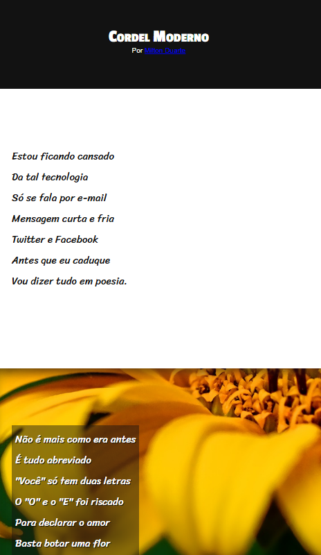

# 📜 Projeto Cordel - Curso em Vídeo

Este projeto foi desenvolvido como parte do curso de **HTML5 e CSS3** ministrado por **Gustavo Guanabara**, no portal [Curso em Vídeo](https://www.cursoemvideo.com).

O objetivo do projeto é criar uma página com **efeito parallax**, simulando um folheto de **literatura de cordel**, com imagens de fundo fixas e textos poéticos sobrepostos.

---

## 🎯 Objetivos do Projeto

- Utilizar **efeito parallax** com CSS3 (`background-attachment: fixed`)
- Estilizar elementos de texto com **tipografia personalizada**
- Trabalhar com **seções alternadas** de texto e imagem
- Criar um visual atraente e dinâmico, respeitando a estética da literatura de cordel

---

## 🧰 Tecnologias Utilizadas

- HTML5
- CSS3

---

## 📁 Estrutura do Projeto

```
projeto-cordel/
├── index.html
├── style.css
├── imagens/
│   ├── fundo1.jpg
│   ├── fundo2.jpg
│   └── fundo3.jpg
```

---

## 💻 Funcionalidades

- Página com layout vertical e navegação fluida
- Imagens de fundo fixas com efeito visual de profundidade (parallax)
- Textos poéticos centralizados com destaque visual
- Responsividade básica para dispositivos móveis

---

## 📸 Screenshot



---

## 🔗 Link do projeto para visualização

[🔗 Ver Projeto Online](https://stapani7.github.io/projeto-cordel)

---

## 📚 Créditos

Projeto desenvolvido como parte do curso **HTML5 e CSS3** do **Gustavo Guanabara** – [Curso em Vídeo](https://www.cursoemvideo.com).

---

